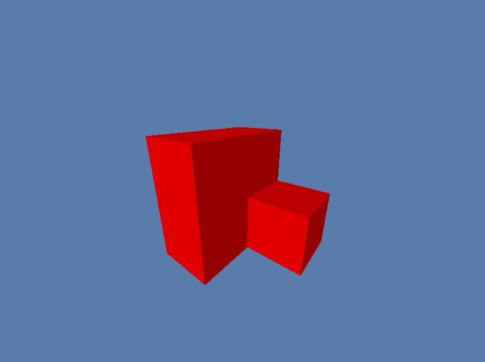

### WGPU Voxel Engine
Here I will test and understand all the voxel rendering tech I see

**controls**
Press `L` to toggle freecam

**What is working**
- Meshing the chunk to a single mesh, empty inside (face culling disabled for testing for now)
- Single chunk rendering
- Simple directional diffuse lighting, but very memory efficient, see `voxel.wgsl` for details

